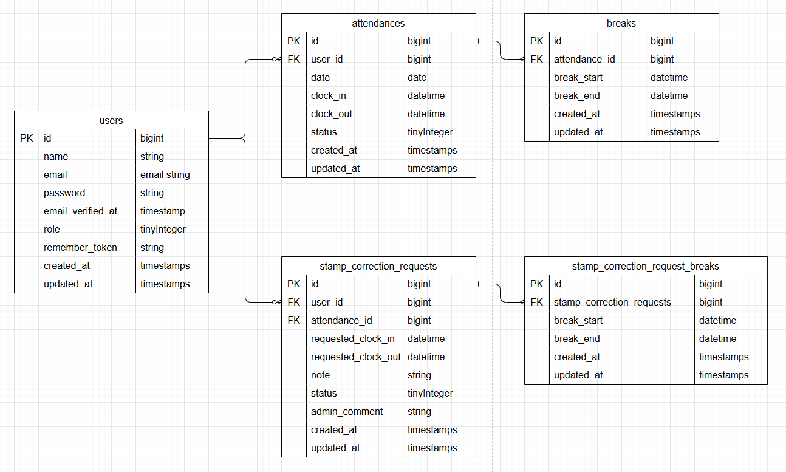

# 模擬案件2
coachtech 勤怠管理アプリ

# Laravel初期設定

クローンの作成 git clone https://github.com/sub-law/coachtech-mock-project-02.git

## Docker 用 .env作成(プロジェクト直下で実行)
touch .env

### 作成した.envに以下を記述（UID/GIDはホストOSのユーザーIDに合わせて設定）
Linux 環境の一般ユーザーは多くの場合、以下の値になります
UID=1000
GID=1000

#### 他の環境では以下のコマンドでホストユーザーのUID/GIDを確認し、同じ値を記述してください
id

## Docker ビルド 
docker-compose up -d --build

## コンテナ操作
PHPコンテナに入る 
docker-compose exec php bash

## Composer インストール
composer install

## .env 作成
cp .env.example .env

### アプリキー生成
php artisan key:generate

### マイグレーション実行
マイグレーション 
php artisan migrate

### ダミーデータ投入
ダミーデータ作成 
php artisan db:seed
#### 
勤怠データの基本情報、勤務時間09:00~18:00/休憩時間12:00~13:00、土日の勤怠実績なし
先月の勤怠データと、当月分の勤怠データになります(当月分は前日までのものとなります)

そのため月初にダミーデータを投入した際は先月分の勤怠データのみとなり、当月分の勤怠データは空となります

# 各キャッシュのクリアコマンド(動作が不安定な場合に使用してください)
php artisan view:clear
php artisan route:clear
php artisan config:clear
php artisan cache:clear

## PHPコンテナから出る　
Ctrl+D（または exit）

# ログインについての重要な注意
本アプリケーションでは、管理者（admin）と一般ユーザー（web）でセッションを分離しています。そのため、同一ブラウザ上で管理者と一般ユーザーを同時にログイン・操作しても問題ありません。

ただし、同一ブラウザ内で複数の一般ユーザーが連続して新規登録・ログインを行う場合、セッション情報が上書きされることで 419 エラー（CSRF トークンエラー）が発生する可能性があります。

この問題が発生した場合は、別のブラウザ（Chrome / Edge など）を使用して新規登録・ログインを行ってください。

# 動作確認URL一覧
会員登録画面（一般ユーザー）：	http://localhost/register

ログイン画面（一般ユーザー）	http://localhost/login

ログイン画面（管理者）：	http://localhost/admin/login

MySQL画面：	http://localhost:8080

mailhog認証画面：	http://localhost:8025/

# ダミーデータユーザー情報（管理者1名、一般ユーザー6名）

## 管理者
name  管理者
email  admin@example.com
password  password123
メール認証済み

## 1
name  西　伶奈
email  reina.n@coachtech.com
password  password123
メール認証済み
※このユーザーには前月の勤怠記録に平日の勤怠データなし・退勤の打刻忘れ、休憩2回のデータを付与しています、勤怠修正の動作確認等に使用してください

## 2
name  山田　太郎
email  taro.y@coachtech.com
password  password123
メール認証済み

## 3
name  増田　一世
email  issei.m@coachtech.com
password  password123
メール認証済み

## 4
name  山本　敬吉
email  keikichi.y@coachtech.com
password  password123
メール認証済み

## 5
name  秋田　朋美
email  tomomi.a@coachtech.com
password  password123
メール認証済み

## 6
name  中西　教夫
email  norio.n@coachtech.com
password  password123
メール認証済み

# MailHogのメール認証手順
1. 新規ユーザー登録を行う
2. メール認証誘導画面に遷移、「認証はこちらから」のボタンをクリック
3. 以下のURLから MailHog にアクセスするので、メール内容を確認してください  
   👉 [http://localhost:8025]
4. 自身が登録したメール本文内の「メールアドレスを確認する」または「Verify Email Address」をクリックすると、認証が完了し、初回はプロフィール設定画面に遷移します
※MailHog画面内で認証リンクをクリックした際、1回目は反応しない場合があります。
その際はメール一覧画面に戻り、再度メール本文内の「メールアドレスを確認する」または「Verify Email Address」をクリックしてください。

# 仕様環境
PHP: 8.1.33 (CLI/FPM)
Laravel Framework: 8.83.8 (LTS)
MySQL: 8.0.26
nginx: 1.21.1
MailHog

# テストケース確認コマンド
※ テストはすべて PHP コンテナ内で実行してください。

## PHPコンテナに入る
docker-compose exec php bash

### 全テスト
php artisan test tests/Feature

#### 各項目テスト
ID1：認証機能（一般ユーザー）
php artisan test tests/Feature/RegisterTest.php

ID2：ログイン認証機能（一般ユーザー）
php artisan test tests/Feature/LoginTest.php

ID3：ログイン認証機能（管理者）
php artisan test tests/Feature/AdminLoginTest.php

ID4：日時取得機能
php artisan test tests/Feature/AttendanceDateTimeTest.php

ID5：ステータス確認機能
php artisan test tests/Feature/AttendanceStatusTest.php

ID6：出勤機能
php artisan test tests/Feature/AttendanceClockInTest.php

ID7：休憩機能
php artisan test tests/Feature/AttendanceBreakTest.php

ID8：退勤機能
php artisan test tests/Feature/AttendanceClockOutTest.php

ID9：勤怠一覧情報取得機能（一般ユーザー）
php artisan test tests/Feature/AttendanceListTest.php

ID10：勤怠詳細情報取得機能（一般ユーザー）
php artisan test tests/Feature/UserAttendanceDetailTest.php

ID11：勤怠詳細情報修正機能（一般ユーザー）
php artisan test tests/Feature/UserAttendanceCorrectionTest.php

ID12：勤怠一覧情報取得機能（管理者）
php artisan test tests/Feature/AttendanceAdminListTest.php

ID13：勤怠詳細情報取得・修正機能（管理者）
php artisan test tests/Feature/AdminAttendanceDetailTest.php

ID14：ユーザー情報取得機能（管理者）
php artisan test tests/Feature/AdminStaffTest.php

ID15：勤怠情報修正機能（管理者）
php artisan test tests/Feature/AdminStampCorrectionRequestTest.php

ID16：メール認証機能
php artisan test tests/Feature/EmailVerificationTest.php

#### テストケース補足
質問回数も採点基準となっていましたので、機能要件との整合性が取れていないテストケースにつきましては機能要件に合わせて修正させていただきました

##### ID6：出勤機能
出勤ボタンが正しく機能するの期待挙動において画面上のステータスが「勤務中」になる

機能要件(FN020)並びにfigmaでは「勤務中」ではなく出勤中」となっています

そのため機能要件「出勤中」を確認するテストとなっています

##### ID11：勤怠詳細情報修正機能（一般ユーザー）
出勤時間が退勤時間より後になっている場合、エラーメッセージが表示される
「出勤時間が不適切な値です」というバリデーションメッセージが表示される

機能要件(FN029)
出勤時間が退勤時間より後になっている場合，および退勤時間が出勤時間より前になっている場合に以下のメッセージを表示
「出勤時間もしくは退勤時間が不適切な値です」

そのため機能要件「出勤時間もしくは退勤時間が不適切な値です」のエラーメッセージを確認するためのテストとなっています

# PHPコンテナから出る　
Ctrl+D（または exit）

# 補足（環境関連）
- MailHogはローカル開発用のSMTPキャプチャツールです。メールは実際には送信されません。
- UID/GIDはLinux環境で `id` コマンドにより確認可能です。
- ER図は設計の参考用です。実装と完全一致しない場合があります。

# ER図

※ Makefile は開発効率向上のための補助ツールです。
※ 採点時は README の手順に従ってセットアップしてください。